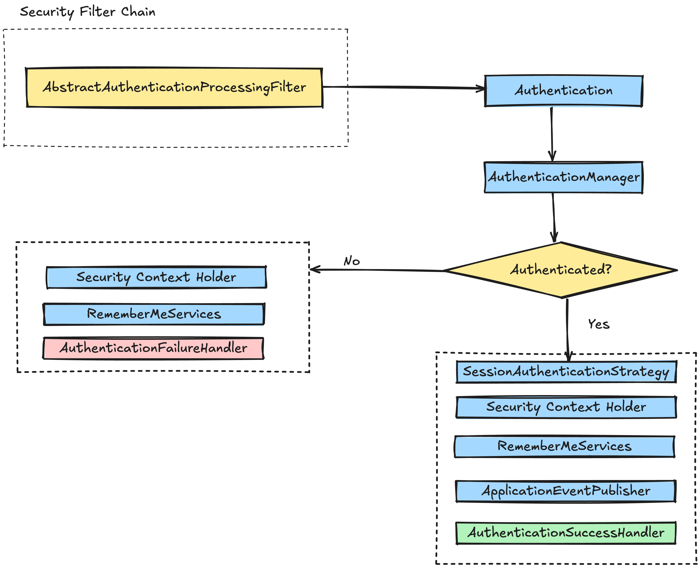

# Authentication Architecture

### AbstractAuthenticationProcessingFilter 

Base Filter used for authentication. This also gives a good idea of the high level flow of authentication and how pieces work together.

### Authentication 

Can be the input to AuthenticationManager to provide the credentials a user has provided to authenticate or the current user from the SecurityContext.

### AuthenticationManager 

The API that defines how Spring Security’s Filters perform authentication.

### ProviderManager 

The most common implementation of AuthenticationManager.

### AuthenticationProvider 

Used by ProviderManager to perform a specific type of authentication.

### SecurityContextHolder

The SecurityContextHolder is where Spring Security stores the details of who is authenticated.

### SecurityContext 

Is obtained from the SecurityContextHolder and contains the Authentication of the currently authenticated user.

### GrantedAuthority 

An authority that is granted to the principal on the Authentication (i.e. roles, scopes, etc.)

