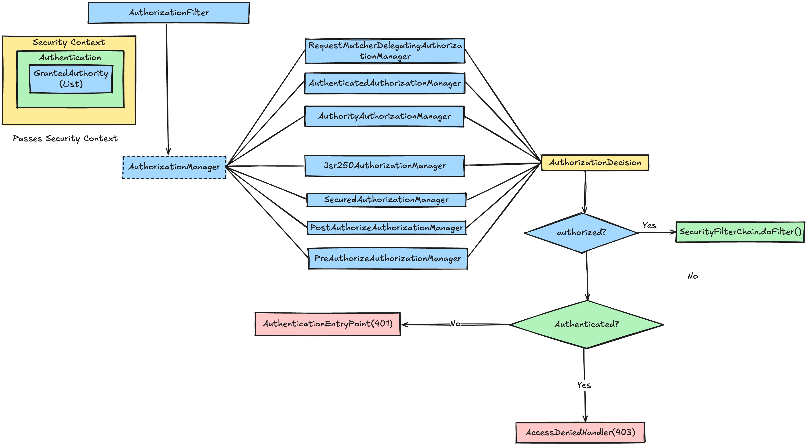

# Authorization Architecture

### AuthorizationFilter
Intercepts requests and uses an `AuthorizationManager` to determine if the authenticated user has permission to access the requested resource.

### AuthorizationManager

The main interface for making authorization decisions. Takes an `Authentication` object and the secured object (like an HTTP request) as input, and returns an `AuthorizationDecision`.

### RequestMatcherDelegatingAuthorizationManager

The primary `AuthorizationManager` used by `AuthorizationFilter`. Delegates to different authorization managers based on request patterns (URL matchers). This is what gets configured when you use `authorizeHttpRequests()` in your security configuration.

### AuthenticatedAuthorizationManager

Checks if the user is authenticated (not anonymous). Used internally when you configure `.authenticated()` in your security rules. Returns granted if the user has successfully authenticated.

### AuthorityAuthorizationManager

Checks if the user has specific authorities or roles. Used with `.hasAuthority("WRITE")` or `.hasRole("ADMIN")`.

### Jsr250AuthorizationManager

Handles JSR-250 security annotations like `@RolesAllowed`, `@PermitAll`, and `@DenyAll`.

### SecuredAuthorizationManager

Handles the `@Secured` annotation for method-level security. Checks if the user has any of the specified security attributes (typically roles).

### PostAuthorizeAuthorizationManager

Evaluates `@PostAuthorize` annotations after method execution. ses SpEL expressions.

### PreAuthorizeAuthorizationManager

Evaluates `@PreAuthorize` annotations before method execution. Uses SpEL expressions.

### AuthorizationDecision

The result object returned by `AuthorizationManager.check()`. Contains a boolean `granted` property indicating whether access is allowed. If `granted` is false or the decision is null, an `AccessDeniedException` is thrown.
